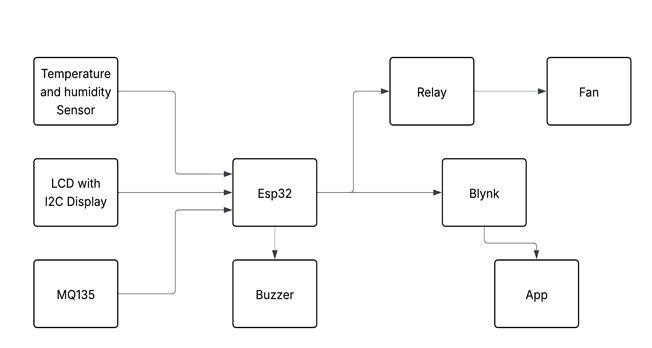
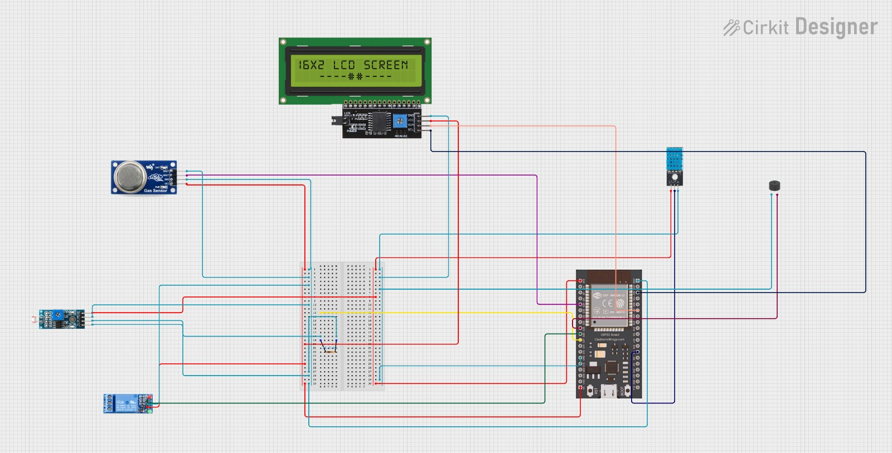
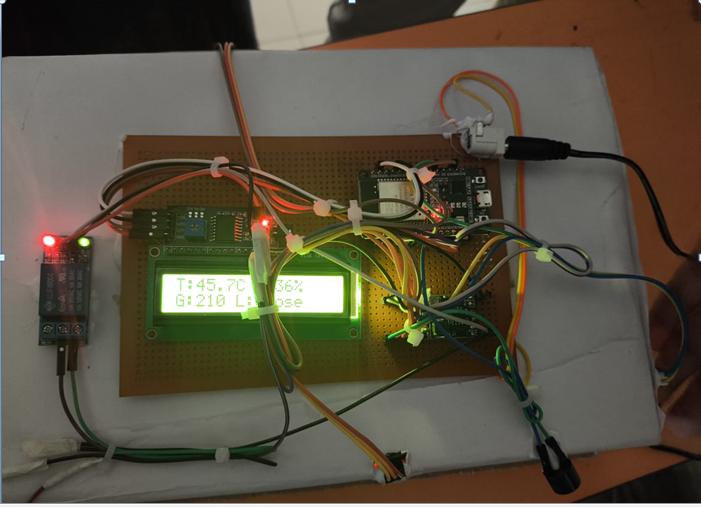
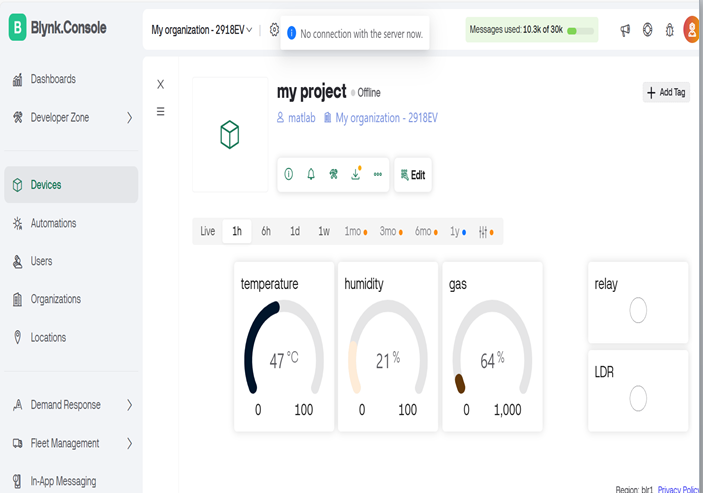

# 🧊 Cold Storage Monitoring System using ESP32 and Blynk

This project is an intelligent IoT-based cold storage monitoring system. It ensures that food or sensitive items are stored in a safe, monitored environment with real-time temperature, humidity, and gas level tracking. It provides local alerts using LCD and buzzer, and remote alerts via the Blynk mobile app.

---

## 🧱 Block Diagram

### 📝 Block Diagram Explanation

The system uses an *ESP32* microcontroller as the brain. It interfaces with:
- A *DHT11 sensor* to read temperature and humidity
- An *MQ135 gas sensor* to detect harmful gases
- An *LDR* to monitor light inside the storage
- A *Relay Module* to automatically control a cooling *fan*
- A *Buzzer* to alert users of any hazardous condition
- An *LCD display (I2C)* for local real-time monitoring
- The *Blynk app* to display values remotely via Wi-Fi

Each component connects to designated GPIO pins on the ESP32 as shown in the block diagram.

---

## Circuit Diagram

### 📝 Circuit Diagram Explanation

The circuit was designed using *Cirkit Designer* software. It shows:
- Power supply from 12V adapter regulated using a *buck converter*
- Proper 3.3V and 5V supply lines to each sensor/module
- Sensors connected to the appropriate GPIO pins:
  - DHT11 → GPIO 4
  - MQ135 (AOUT) → GPIO 34
  - LDR → GPIO 27
  - Relay → GPIO 26
  - Buzzer → GPIO 25
  - LCD I2C → SDA (GPIO 21), SCL (GPIO 22)
- Ground connections common across all components
- The fan is controlled by the relay based on sensor values

---

## 🔌 Reference Pin Connections

All connections in the circuit and code are mapped as:

| Component | ESP32 Pin |
|----------|------------|
| DHT11    | GPIO 4     |
| MQ135 (AOUT) | GPIO 34 |
| LDR      | GPIO 27    |
| Relay    | GPIO 26    |
| Buzzer   | GPIO 25    |
| LCD SDA  | GPIO 21    |
| LCD SCL  | GPIO 22    |

These pins are defined in the Arduino .ino file provided in the code/ folder.

---

## 🧾 Source Code Reference

The main Arduino file is located at:  
📁 [/code/Cold_storage.ino](code/Cold_storage.ino)

It includes:
- Sensor initialization
- Blynk Wi-Fi connection and virtual pins
- LCD updates
- Threshold checks and control logic (fan, buzzer)
- Data transmission to the Blynk mobile app

---

## 📺 LCD Reading (Live Data Preview)

### 📝 LCD Explanation

The *16x2 LCD* (I2C) shows real-time temperature and gas values.  
From the image above:

- Temperature: 27°C  
- Gas Level: Within safe range

The LCD updates every 2–3 seconds and provides a *local display*, even without internet.

---

## 📱 Blynk App Dashboard

### 📝 Blynk Explanation

The *Blynk mobile app* provides a remote dashboard:

- Shows *Temperature, **Humidity, **Gas level, and **Light status*
- Easy to monitor via mobile
- Can be configured to send *notifications* or *trigger outputs* (like alarms/fans)

The ESP32 pushes sensor values to Blynk using the Blynk library over Wi-Fi.

---
""Documentation""

For a detailed explanation of the project, please refer to the documentation:

- Documentation Index: 📁 [/docs/documentaion_index.docx](docs/documentation_index.docx)
- Detailed Documentation: 📁 [/docs/documentaion.docx](docs/documentation.docx)

These documents provide a comprehensive overview of the project's architecture, functionality, and implementation details.

## 📋 Summary

This Cold Storage Monitoring System is:
- Low-cost
- Modular
- Easily scalable
- Perfect for small warehouses, food storage, or labs

It uses *real-time IoT feedback* to ensure optimal environmental conditions — both locally and remotely.

---
""Important Notice to be Consider""

This repository is a draft for an IoT-based cold storage monitor project. It is not suitable for industrial use without further development, testing, and validation.

You can use this project as a reference or inspiration for your own projects, but please be aware that it may not meet the requirements or standards for industrial applications.

Use at your own risk. If you're planning to use this project in a production environment, we strongly recommend that you thoroughly review, test, and validate the code and hardware to ensure it meets your specific needs and industry standards.

## 👥 Team Members

- Shaik Abrar Ali (Abrar7789)
- K.Nanditha (Nanditha-429)
- Ch.Abhilash (ChamanthulaAbhilash)

---

## 📄 License

Licensed under the *GNU GPL v3 License*  
See [LICENSE](LICENSE) file for details.
